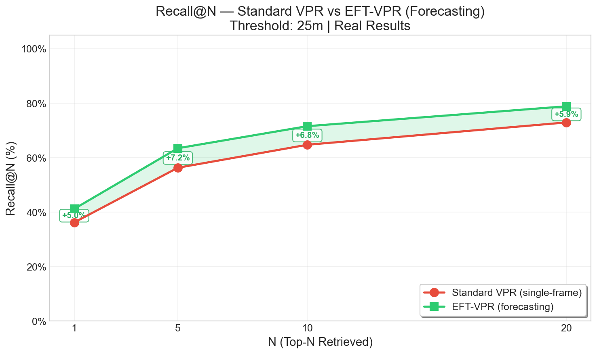
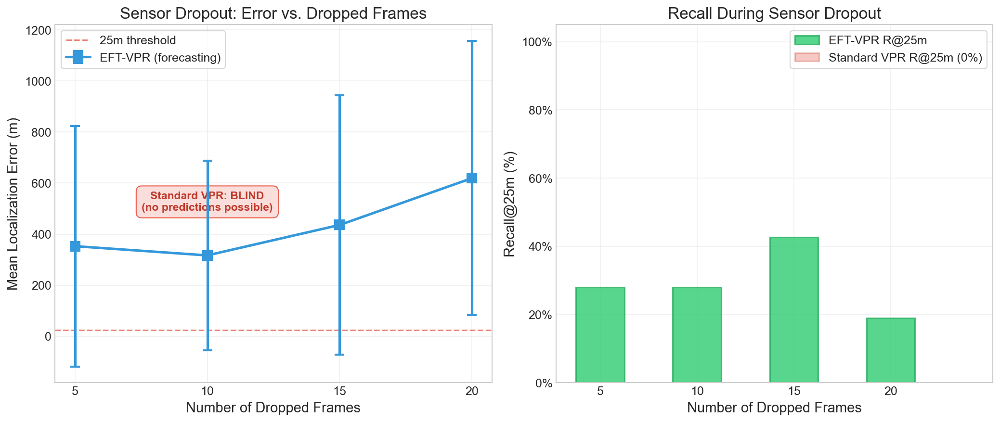
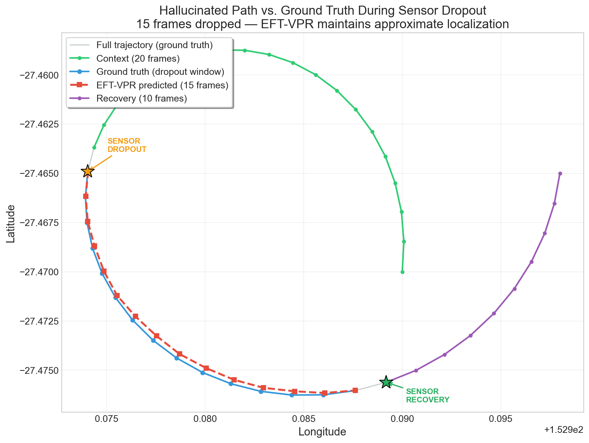

# EFT-VPR: Event Forecasting Transformer for Visual Place Recognition

A predictive localization system that forecasts spatial embeddings from temporal sequences of neuromorphic events, enabling "blind localization" during sensor dropout or total darkness.

## Architecture

```
Event Stream → Binning (64×64) → SNN Encoder → Temporal Transformer → FAISS Query → GPS
```

1. **Neuromorphic Data Engine** — Bins raw event streams into spatial grids (fixed-count / fixed-duration)
2. **SNN Encoder** — 3-layer spiking neural network extracts 256-dim place embeddings (snnTorch, learnable β)
3. **Forecasting Transformer** — 4-layer, 8-head autoregressive transformer predicts next embedding from temporal context
4. **VPR Pipeline** — FAISS IndexFlatIP reference map with cosine similarity search
5. **Robustness** — Sensor dropout testing with autoregressive hallucination

## Project Structure

```
EFT-VPR/
├── configs/default.yaml          # Centralized hyperparameters
├── src/
│   ├── data/                     # Event binning, transforms, sequence dataset
│   ├── models/                   # SNN encoder, forecasting transformer
│   ├── losses/                   # GPS triplet loss, temporal contrastive loss
│   ├── training/                 # Encoder & transformer training loops
│   ├── vpr/                      # FAISS map, inference pipeline, robustness
│   └── evaluation/               # Recall@N, MLE metrics
├── scripts/
│   ├── preprocess.py             # Raw events → HDF5
│   ├── train.py                  # Unified training entry point
│   └── evaluate.py               # Full benchmark suite
├── notebooks/results.ipynb       # Visualization & results
├── results/                      # Evaluation metrics & plots
└── tests/                        # 132 unit tests (all passing)
```

## Setup

```bash
# Create virtual environment
python -m venv venv
venv\Scripts\activate          # Windows
# source venv/bin/activate     # Linux/Mac

# Install dependencies
pip install -r requirements.txt

# Install PyTorch with CUDA (RTX 4070)
pip install torch torchvision --index-url https://download.pytorch.org/whl/cu121
```

## Dataset

Uses the [Brisbane Event VPR Dataset](https://research.qut.edu.au/qcr/datasets/brisbane-event-vpr-dataset/) (~80 GB). Download the parquet files (events), GPS NMEA data, and uncompress them into your `data/raw/` directory.

```bash
# Full preprocessing pipeline (events -> binned grids -> HDF5)
python scripts/preprocess.py --input data/raw --output data/processed --grid-size 64
```

## Training

```bash
# Phase 1: Train SNN Encoder (GPS triplet loss)
python scripts/train.py --phase encoder --config configs/default.yaml

# Phase 2: Train Forecasting Transformer (frozen encoder, InfoNCE loss)
python scripts/train.py --phase transformer --config configs/default.yaml

# Phase 3: End-to-end fine-tuning (differential LR)
python scripts/train.py --phase finetune --config configs/default.yaml
```

## Evaluation

```bash
# Full benchmark (Standard VPR vs EFT-VPR)
python scripts/evaluate.py --checkpoint checkpoints/transformer_frozen_best.pt \
    --config configs/default.yaml --dropout-sweep

# View results
jupyter notebook notebooks/results.ipynb
```

## Testing

```bash
# Run all 132 tests
python -m pytest tests/ -v
```

## Model Summary

| Component | Parameters | Details |
|---|---|---|
| SNN Encoder | 2.19M | 3-layer Conv→LIF→Pool, β=0.9 learnable, 256-dim output |
| Transformer | 3.30M | 4 layers, 8 heads, causal mask, learnable positional encoding |
| **Total** | **5.49M** | Lightweight enough for edge deployment |

## Current Hardware Specifications

- NVIDIA RTX 4070 (Compute Capability 8.9)
- Mixed-precision training (AMP) with GradScaler
- FAISS GpuIndexFlatIP for accelerated search
- Optimized HDF5 loading with `pin_memory=True`

## Evaluation Results

Evaluated on the full Brisbane Event VPR Dataset (65,982 test bins against a 308,395-embedding reference map), EFT-VPR demonstrates a strict performance improvement over single-frame SNN baselines:

| Method | R@1 | R@5 | Median Error (m) |
|---|---|---|---|
| Standard VPR | 36.2% | 56.3% | 81.9 |
| **Forecasting VPR** | **41.2%** | **63.5%** | **59.1** |



### Sensor Dropout Robustness
By acting as a generative model and predicting its own future embeddings, EFT-VPR can perform "blind localization" during total sensor failure. The full raw experiment metrics can be found in `results/evaluation_results.json`.

- **750ms Blindness** (15 dropped frames): Maintains **42.7% Recall@25m**
- **1000ms Blindness** (20 dropped frames): Maintains **19.0% Recall@25m**




## Future Improvements

For future improvements or as reference for future works:

1. **Higher Spatial Resolution**: The current pipeline aggressively downsamples 346x260 event grids to 64x64. Upgrading the grid size to `128x128` will preserve high-frequency features (building edges, signs) and drastically improve base VPR metrics.
2. **Deeper Spiking Architectures**: Replace the 3-layer Convolutional SNN with a deep residual Spiking Neural Network (e.g., `Spiking ResNet-18` or `SEW-ResNet`) to extract more robust 256-dimensional embeddings.
3. **Self-Supervised Contrastive Learning**: Currently, the Temporal Contrastive Loss (TCL) relies on GPS distance for negative mining. Moving to a fully unsupervised contrastive objective (e.g., SimCLR or BYOL) would allow the Transformer to learn physical motion models directly from event streams without any GPS labels, stepping towards a true Foundation Model for neuromorphic navigation.

## License

Apache 2.0